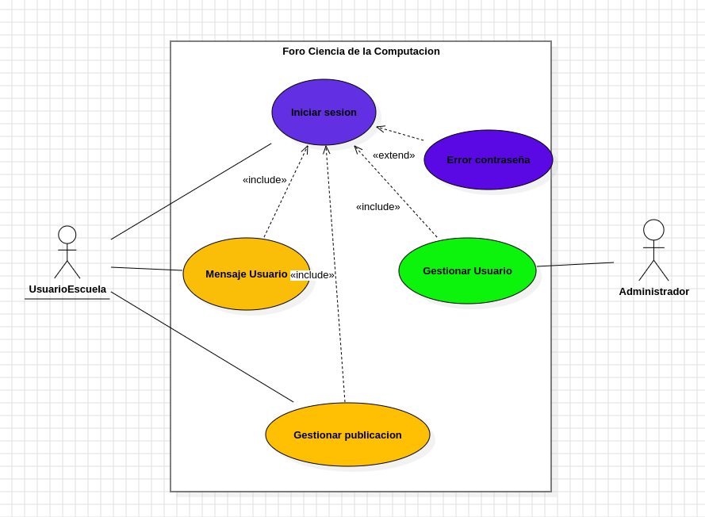
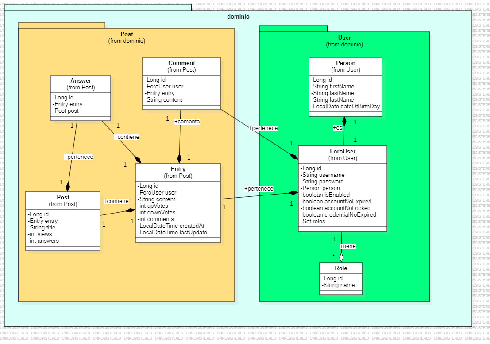
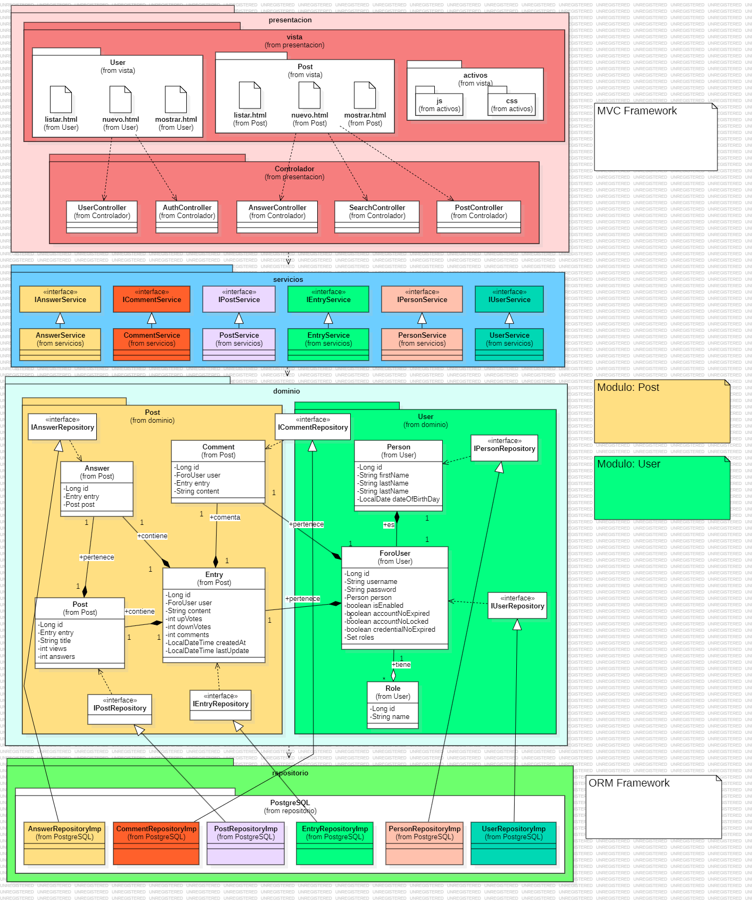

# Proyecto de Foro
## Propósito del proyecto
El propósito principal de este proyecto es desarrollar una plataforma web que facilite la interacción y el intercambio de información entre los miembros de una comunidad determinada. La aplicación permitirá a los usuarios crear perfiles, publicar contenido, comentar publicaciones de otros, seguir a personas de interés y establecer conexiones más sólidas dentro del grupo, realizar este proyecto también nos ayudará con :  
- Familiarización con nuevas herramientas y tecnologías: Trabajar en este proyecto nos permitió familiarizarse con una serie de tecnologías esenciales como Spring boot, React, Spring Security y JWT, PostgreSQL;
- Desarrollo de una arquitectura completa de aplicaciones: Este proyecto abarca tanto el frontend como el backend, permitiéndonos entender cómo interactúan y se integran estos componentes.
- Mejora de habilidades en programación y debugging: Desarrollar y depurar una aplicación compleja mejora las habilidades de resolución de problemas. Enfrentarse a errores y desafíos reales fomenta el aprendizaje de soluciones creativas y efectivas.
- Integración de múltiples tecnologías: Trabajar en un proyecto que integra varias tecnologías ayuda a comprender cómo se combinan para crear una aplicación funcional. Esto incluye la gestión de dependencias, configuración de entornos y aseguramiento de que todos los componentes funcionen en armonía.
- Desarrollo de buenas prácticas y patrones de diseño: Aplicar patrones de diseño y buenas prácticas en el desarrollo de software es esencial. Este proyecto enseña la separación de responsabilidades, el uso de controladores y servicios, y la implementación de patrones como MVC (Modelo-Vista-Controlador).
- Experiencia en manejo de proyectos y colaboración: Utilizar herramientas como Trello para la gestión de tareas y proyectos proporciona experiencia en la planificación y ejecución de proyectos, gestión de plazos y colaboración con otros desarrolladores.
- Preparación para entrevistas técnicas: El conocimiento y la experiencia práctica obtenidos son altamente valorados en entrevistas técnicas. Trabajar en un proyecto completo proporciona ejemplos concretos y experiencias para discutir durante las entrevistas.
En conclusión desarrollar un foro es más que un simple ejercicio técnico; es una oportunidad de aprendizaje integral. Que nos permitió adquirir una comprensión profunda y práctica de las tecnologías modernas, preparándonos para desafíos más avanzados.


## Funcionalidades 
### Diagrama de casos de uso:

 
### Funcionalidades de Alto Nivel
**Autenticación y Autorización de Usuarios**
- Registro de usuarios.
- Inicio de sesión y cierre de sesión.
- Gestión de roles y permisos (administradores, usuarios regulares).

**Gestión de Preguntas**
- Publicación de nuevas preguntas.
- Edición y eliminación de preguntas.
- Visualización de preguntas con detalles.
- Marcado de preguntas como favoritas.

**Gestión de Respuestas**
- Publicación de respuestas a preguntas.
- Edición y eliminación de respuestas.
- Marcado de una respuesta como la aceptada por el autor de la pregunta.
- Comentarios en respuestas.

**Búsqueda y Filtrado de Contenido**
- Búsqueda de preguntas y respuestas por palabras clave.
- Filtrado de contenido por etiquetas, fecha, popularidad, votos, etc.
- Sugerencias automáticas de preguntas similares al escribir una nueva pregunta.

**Notificaciones**
- Notificaciones en tiempo real sobre nuevas respuestas, comentarios y otras actividades relacionadas con el usuario.

**Perfil de Usuario**
- Visualización y edición de información de perfil (nombre, biografía, foto de perfil, etc.).
- Historial de preguntas, respuestas, comentarios y votos del usuario.

**Moderación de Contenido**
- Sistema de reportes para contenido inapropiado.
- Revisión y acción sobre reportes por parte de moderadores (eliminar, bloquear, advertir).
- Historial de acciones de moderación.

**Interfaz de Usuario y Experiencia de Usuario (UI/UX)**
- Diseño responsive y accesible para diferentes dispositivos.
- Navegación intuitiva y organizada.
- Elementos de interfaz claros y consistentes.

## Modelo de Dominio
 

## Arquitectura y Patrones
 


## Prácticas de codificación limpia aplicadas

### 1. Nombres descriptivos y significativos

Los nombres de clases, métodos y variables son claros y descriptivos, lo que mejora la legibilidad del código.
solo leer los nombres de los métodos, entendemos exactamente qué hacen. `createAnswer` y `getAnswerById`. Esto hace que el código sea más fácil de entender y mantener.

- **Ejemplo**:

```java
public class PostService implements IPostService {
    public Post createPost(Long idUser, String title, String content) {
        // ...
    }
}
```

```java
public interface IAnswerService {
  public Answer createAnswer(Long postIdToReply, String content);
  public Answer getAnswerById(Long idAnswer);
}
```


### 2. Principio de Responsabilidad Única (SRP)

Cada clase tiene una única responsabilidad. Por ejemplo, la clase `PostService` se encarga únicamente de las operaciones relacionadas con los posts.

Esta clases se encarga únicamente de las operaciones relacionadas con comentarios. No maneja posts, ni usuarios, solo comentarios. Esto hace que el código sea más modular y fácil de modificar.

- **Ejemplo**:

```java
@Service
public class CommentService implements ICommentService {
    public Comment postComment(Long postId, Long userId, String content) {
        // ...
    }
    public Comment answerComment(Long answerId, Long userId, String content) {
        // ...
    }
}
```


### 3. Uso de interfaces

Se utilizan interfaces para definir contratos, lo que mejora la modularidad y facilita el mantenimiento.

- **Ejemplo**:

```java
public interface IPostService {
    Post createPost(Long id_user, String title, String content);
    boolean index();
    List<Post> searchWord(String query);
}
```

### 4. Manejo de excepciones personalizado

Se crean excepciones personalizadas para manejar errores específicos del dominio.
Creando excepciones personalizadas nos permite manejar errores específicos de nuestra aplicación de manera más clara y precisa.

- **Ejemplo**:

```java
public class CreationException extends RuntimeException {
    public CreationException(String message) {
        super(message);
    }
}
```
```java
public class UnauthorizedException extends RuntimeException {
  public UnauthorizedException(String message) {
    super(message);
  }
}
```


### 5. Inyección de Dependencias

Se utiliza la inyección de dependencias para reducir el acoplamiento entre clases.
La inyección de dependencias nos permite desacoplar las clases y hace que nuestro código sea más flexible y fácil de probar.

- **Ejemplo**:

```java
@Service
public class PostService implements IPostService {
    private EntryService entryService;
    private PostRepositoryImp postRepository;
    private UserService userService;

    public PostService(EntryService entryService, PostRepositoryImp postRepository, UserService userService) {
        this.entryService = entryService;
        this.postRepository = postRepository;
        this.userService = userService;
    }
    // ...
}
```

```java
@Service
public class AnswerService implements IAnswerService {
  private UserService userService;
  private PostService postService;

  public AnswerService(UserService userService, PostService postService) {
    this.userService = userService;
    this.postService = postService;
  }
  // ...
}
```

## Estilos de Programación aplicados

### 1. Programación Orientada a Objetos (OOP)

El estilo orientado a objetos se centra en clases y objetos que encapsulan estado y comportamiento. PostService es una clase que encapsula la lógica de creación de publicaciones mediante el repositorio PostRepository

- **Ejemplo**:

```java
@Entity
@Table(name = "post")
@Indexed
public class Post {
    @Id
    @GeneratedValue(strategy = GenerationType.IDENTITY)
    private Long id;

    @OneToOne(cascade = CascadeType.REMOVE)
    @JoinColumn(name = "id_entry", referencedColumnName = "id", foreignKey = @ForeignKey(name = "FK_entry_post"), nullable = false)
    private Entry entry;

    // ...
}
```

### 2. Programación por Capas

El proyecto está estructurado en capas (controladores, servicios, repositorios), lo que mejora la separación de responsabilidades.Esta separación hace que el código sea más organizado y fácil de mantener.

- **Ejemplo**:

```java
@RestController
@RequestMapping("/post")
public class PostController {
    private PostService postService;

    @PostMapping("/createPost")
    public Post createPost(@RequestBody CreatePostFieldsDTO fields) {
        return postService.createPost(fields.id(), fields.title(), fields.content());
    }
}
```

```java
// Capa de Controlador
@RestController
@RequestMapping("/auth")
public class AuthController {
    @PostMapping("/signin")
    public TokenResponse loginUser(@RequestBody LoginRequestDTO loginRequest) {
        return userService.loginUser(loginRequest);
    }
}

// Capa de Servicio
@Service
public class UserService implements IUserService {
    public TokenResponse loginUser(LoginRequestDTO loginRequest) {
        // Lógica de negocio aquí
    }
}
```


### 3. **Pipelines (Pipe and Filter) Style**:

   - Este estilo se caracteriza por una serie de pasos consecutivos donde la salida de un paso es la entrada del siguiente. En este método, los datos se extraen del DTO, se procesan llamando al servicio, y finalmente se devuelve el resultado.

   - **Ejemplo**:
     ```java
     @PostMapping("/create")
     public Answer createAnswerForPost(@RequestBody CreateAnswerFieldsDTO fieldsDTO) {
       // Step 1: Extract postId and content from DTO
       Long postId = fieldsDTO.postId();
       String content = fieldsDTO.content();

       // Step 2: Call the service to create the answer
       Answer answer = answerService.createAnswer(postId, content);

       // Step 3: Return the created answer
       return answer;
     }
     ```


### 4. **Cookbook Style**:

    - El estilo Cookbook utiliza recetas estándar para resolver problemas comunes. Aquí, se sigue una receta para obtener un usuario por nombre de usuario y devolverlo envuelto en un `ResponseEntity`.

   - **Ejemplo**:
     ```java
     @GetMapping("/{username}")
     public ResponseEntity<ForoUser> getUserByUsername(@PathVariable String username) {
       // Recipe for fetching user by username
       ForoUser user = userService.findByUsername(username);
       
       // Return the user wrapped in ResponseEntity
       return ResponseEntity.ok(user);
     }
     ```
   

### 5. **Persistent Tables Style**:

    - Este estilo utiliza estructuras de datos persistentes almacenadas en tablas de bases de datos. La clase `Answer` está mapeada a la tabla `answers`, lo que permite la persistencia de las respuestas en la base de datos.


   - **Ejemplo**:
     ```java
     @Entity
     @Table(name = "answers")
     public class Answer {
       @Id
       @GeneratedValue(strategy = GenerationType.IDENTITY)
       private Long id;

       @ManyToOne
       @JoinColumn(name = "post_id")
       private Post post;

       @Column(nullable = false)
       private String content;

       // Getters and setters...
     }
     ```
   

### 6. **Data-Centric Style**:

    -  El estilo Data-Centric se centra en la definición y manipulación de datos. Aquí, `CreateAnswerFieldsDTO` encapsula los campos necesarios para crear una respuesta, asegurando que los datos están bien definidos y validados.

   - **Ejemplo**:
     ```java
     public record CreateAnswerFieldsDTO(@NotBlank Long postId, @NotBlank String content) {}
     ```
   

### 7. **Domain-Specific Language (DSL) Style**:

       - El estilo DSL utiliza un lenguaje especializado para configurar aspectos específicos del dominio. Las anotaciones de seguridad y enrutamiento en `AdminController` crean un mini-lenguaje para la gestión de controladores administrativos.

   - **Ejemplo**:
     ```java
     @PreAuthorize("hasRole('ADMIN')")
     @RequestMapping("/admin")
     public class AdminController {
       @PostMapping("/deleteUser")
       public ResponseEntity<?> deleteUser(@RequestParam Long userId) {
         // Domain-specific rules and annotations
         userService.deleteUser(userId);
         return ResponseEntity.ok().build();
       }
     }
     ```

## Principios SOLID aplicados: Descripción y Fragmento de Código (evidencia)

### 1. Principio de Responsabilidad Única (SRP)

**Descripción:** Cada clase tiene una única responsabilidad. La clase `PostService` se encarga de la gestión de las operaciones relacionadas con los posts. Esto incluye la creación de posts y la recuperación de posts por ID. El objetivo es mantener toda la lógica relacionada con la gestión de posts en una sola clase.

**Evidencia:**

```java
@Service
public class PostService implements IPostService {

  private EntryService entryService;
  private PostRepositoryImp postRepository;
  private UserService userService;
  private EntityManager entityManager;

  public PostService(EntryService entryService, PostRepositoryImp postRepository, UserService userService, EntityManager entityManager) {
    this.entryService = entryService;
    this.postRepository = postRepository;
    this.userService = userService;
    this.entityManager = entityManager;
  }

  @Override
  @Transactional
  public Post createPost(Long idUser, String title, String content) {
    // Implementación
  }

  @Transactional(readOnly = true)
  public Post getPostById(Long idPost) {
    // Implementación
  }

  // Otros métodos relacionados con posts
}
```

La clase `UserService` se encarga de gestionar las operaciones relacionadas con los usuarios. Esto incluye el registro de usuarios y la obtención de usuarios por ID. Su única responsabilidad es la gestión de usuarios, manteniéndola separada de otras lógicas como la gestión de posts.

```java
@Service
public class UserService implements IUserService {

  private IPersonService personService;
  private UserRepositoryImp userRepository;
  private PasswordEncoder passwordEncoder;
  private JwtUtil jwtUtil;

  public UserService(IPersonService personService, UserRepositoryImp userRepository, PasswordEncoder passwordEncoder, JwtUtil jwtUtil) {
    this.personService = personService;
    this.userRepository = userRepository;
    this.passwordEncoder = passwordEncoder;
    this.jwtUtil = jwtUtil;
  }

  @Override
  @Transactional
  public ForoUser registerUser(SignupFieldsDTO fields) {
    // Implementación
  }

  @Override
  @Transactional(readOnly = true)
  public ForoUser getUserbyId(Long id) { 
    // Implementación
  }

  // Otros métodos relacionados con usuarios
}
```

### 2. Principio de Inversión de Dependencias (DIP)

**Descripción:** Las clases de alto nivel no dependen de las implementaciones de bajo nivel, sino de abstracciones. Este principio ayuda a desacoplar el código, haciendo que las clases y módulos sean más flexibles y fáciles de mantener. El código utiliza una interfaz `IPostService` en lugar de una implementación concreta como `PostService`. Esto es clave para el DIP porque `PostController` no está acoplado a una implementación específica de `IPostService`.

**Evidencia:**

```java
public class PostController {
  private IPostService postService;

  public PostController(PostService postService) {
    this.postService = postService;
  }
}
```

### 3. Principio de Segregación de Interfaces (ISP)

**Descripción:** Las interfaces están divididas en interfaces más pequeñas y específicas. Este principio indica que una interfaz debe ser específica y enfocada en una funcionalidad particular, y no ser "pesada" con métodos que no son relevantes para todos los implementadores de esa interfaz. En otras palabras, los clientes no deberían verse obligados a implementar métodos que no usan. `IPostService` y `IUserService` son ejemplos de interfaces especializadas que agrupan métodos que son relevantes para una única responsabilidad o funcionalidad.

**Evidencia:**

```java
public interface IPostService {
  Post createPost(Long idUser, String title, String content);
  Post getPostById(Long idPost);
  boolean index();
  List<Post> searchWord(String query);
}

public interface IUserService {
  ForoUser registerUser(SignupFieldsDTO fields);
  ForoUser getUserbyId(Long id);
  ForoUser getUserByUsername(String userName);
  UserDetails loadUserByUsername(String username) throws UsernameNotFoundException;
  TokenResponse loginUser(LoginRequestDTO loginRequest);
}
```

### 4. Principio Abierto/Cerrado (OCP)

**Descripción:** Las clases están abiertas para extensión pero cerradas para modificación. El Principio Abierto/Cerrado se aplica al permitir que `PostService` sirva como una clase base estable y completa para la funcionalidad de gestión de posts. `ExtendedPostService` demuestra cómo extender la funcionalidad de `PostService` sin modificarla, añadiendo nuevas funcionalidades a través de la herencia y la sobreescritura de métodos. Esto sigue el principio OCP al permitir que el sistema evolucione sin alterar el código existente.

**Evidencia:**

```java
@Service
public class PostService implements IPostService {
  // Implementación base
  @Override
  public Post createPost(Long idUser, String title, String content) {
    // Implementación
  }
  
  // Otros métodos
}

// Ejemplo hipotético de extensión
@Service
public class ExtendedPostService extends PostService {
  @Override
  public Post createPost(Long idUser, String title, String content) {
    // Nueva implementación o extensión de la funcionalidad
    Post post = super.createPost(idUser, title, content);
    // Lógica adicional
    return post;
  }
  
  // Nuevos métodos o sobreescritura de otros métodos
}
```

### 5. Principio de Sustitución de Liskov (LSP)

**Descripción:** Los objetos de una superclase deben poder ser reemplazados por objetos de sus subclases sin afectar la correctitud del programa. El Principio de Sustitución de Liskov (LSP) se aplica al asegurar que las subclases (`Post` y `Answer`) pueden ser reemplazadas por su superclase (`Entry`) sin afectar la correcta funcionalidad del programa. `Post` y `Answer` heredan de `Entry` y mantienen su comportamiento básico mientras añaden atributos y funcionalidades específicas. Esto garantiza que los objetos de `Post` y `Answer` puedan ser utilizados de manera intercambiable con `Entry` sin introducir errores o comportamientos inesperados.

**Evidencia:**

```java
public class Entry {
  private Long id;
  private ForoUser user;
  private String content;
  private int comments;
  
  // Getters y setters
}

public class Post extends Entry {
  private String title;
  private int views;
  private int answers;
  
  // Getters y setters específicos de Post
}

public class Answer extends Entry {
  private Post post;
  
  // Getters y setters específicos de Answer
}
```

### Entidades, Objetos de Valor, Servicios de Dominio

#### 1. Entidades

**Descripción:** Las entidades son objetos que tienen una identidad única y persisten a lo largo del tiempo. En este código, vemos varias entidades como `Person`, `ForoUser`, `Post`, y `Entry`.

**Fragmento de Código:**

```java
@Entity
@Table(name = "users")
public class ForoUser {
   @Id
   @GeneratedValue(strategy = GenerationType.IDENTITY)
   private Long id; 

   @Column(unique = true)
   private String username;

   @JsonIgnore
   private String password;

   @OneToOne
   @JoinColumn(name = "id_person", referencedColumnName = "id", 
   foreignKey = @ForeignKey(name = "FK_person_user"), nullable = false)
   private Person person;

   // Otros campos y métodos
}
```

#### 2. Objetos de Valor

**Descripción:** Los objetos de valor son inmutables y no tienen identidad propia. En este código, `Role` podría considerarse un objeto de valor, aunque está implementado como una entidad.

**Fragmento de Código:**

```java
@Entity
@Table(name = "roles")
public class Role {
  @Id
  @GeneratedValue(strategy = GenerationType.IDENTITY)
  private Long id;

  private String name;
}
```

#### 3. Servicios de Dominio

**Descripción:** Los servicios de dominio encapsulan lógica de negocio que no pertenece naturalmente a ninguna entidad o objeto de valor. Las clases `Service` como `UserService`, `PostService`, etc., actúan como servicios de dominio.

**Fragmento de Código:**

```java
@Service
public class PostService implements IPostService {

  private EntryService entryService;
  private PostRepositoryImp postRepository;
  private UserService userService;
  private EntityManager entityManager;

  // Constructor

  @Override
  @Transactional
  public Post createPost(Long idUser, String title, String content) {
    try {
      String user = SecurityContextHolder.getContext().getAuthentication().getPrincipal().toString();
      ForoUser userFound = userService.getUserByUsername(user);
      Entry entrySaved = entryService.createEntry(userFound, content);

      Post postCreated = new Post();
      postCreated.setEntry(entrySaved);
      postCreated.setTitle(title);

      return postRepository.save(postCreated);
      
    } catch(Exception e) {
      throw new CreationException("No se pudo crear el post"); 
    }
  }

  // Otros métodos
}
```

Este servicio de dominio (`PostService`) encapsula la lógica de negocio para crear un post, incluyendo la obtención del usuario autenticado, la creación de una entrada asociada, y el guardado del post en el repositorio.

###

 Agregados y Módulos

#### 1. Agregados

**Descripción:** Un agregado es un grupo de objetos relacionados que se tratan como una unidad para propósitos de cambios de datos. En este código, podemos considerar a `Post` como un agregado que incluye `Entry`.

**Fragmento de Código:**

```java
@Entity
@Table(name = "post")
@Indexed
public class Post {

  @Id
  @GeneratedValue(strategy = GenerationType.IDENTITY)
  private Long id;

  @OneToOne(cascade = CascadeType.REMOVE)
  @JoinColumn(name = "id_entry", referencedColumnName = "id", foreignKey = @ForeignKey(name = "FK_entry_post"), nullable = false)
  private Entry entry;

  @FullTextField(analyzer = "name")
  @KeywordField(name = "title_exact", normalizer = "exact")
  @Column(nullable = false)
  private String title;

  @Column(columnDefinition = "INT DEFAULT 0")
  private int views;

  @Column(columnDefinition = "INT DEFAULT 0")
  private int answers;
  
}
```

En este caso, `Post` es el agregado raíz y `Entry` es parte del agregado. La anotación `@OneToOne(cascade = CascadeType.REMOVE)` indica que cuando se elimina un `Post`, su `Entry` asociada también se elimina.

#### 2. Módulos

**Descripción:** Los módulos son unidades de organización que agrupan clases relacionadas. Tenemos módulos por la estructura de paquetes y la organización de las clases en servicios, repositorios, controladores, etc.

**Fragmento de Código:**

```java
// Módulo de usuario
package com.app.services.implementations;

@Service
public class UserService implements IUserService {
    // Implementación del servicio de usuario
}

// Módulo de post
package com.app.services.implementations;

@Service
public class PostService implements IPostService {
    // Implementación del servicio de post
}

// Módulo de autenticación
package com.app.controller;

@RestController
@CrossOrigin("http://localhost:3000/")
@PreAuthorize("permitAll")
@RequestMapping("/auth")
public class AuthController {
    // Implementación del controlador de autenticación
}
```

Estos fragmentos muestran cómo el código está organizado en diferentes módulos (servicios, controladores) que se enfocan en aspectos específicos de la aplicación (usuarios, posts, autenticación).

### Fábricas o (Factories)

**Descripción:** No se realizaron específicamente fábricas en el proyecto. Las fábricas son patrones de diseño utilizados para crear objetos sin especificar la clase exacta del objeto que se creará. En su lugar, utilizamos principalmente inyección de dependencias y el patrón Builder para la creación de objetos.

Por ejemplo, el patrón Builder se usa en varias entidades:

```java
Person joseP = Person.builder()
    .firstName("Jose")
    .lastName("Lopez")
    .email("mairiciohualpa@gmail.com")
    .dateOfBirthDay(LocalDate.of(2000, 8, 28))
    .build();
```

Aunque esto no es una fábrica en el sentido estricto, proporciona una forma flexible de crear objetos con muchos parámetros opcionales.

### Repositorios

**Descripción:** Los repositorios son interfaces que encapsulan la lógica de acceso a datos y proporcionan una abstracción de la capa de persistencia. Utilizamos repositorios de Spring Data JPA.

**Fragmento de Código:**

```java
@Repository
public interface PersonRepositoryImp extends JpaRepository<Person, Long> {
}

@Repository
public interface EntryRepositoryImp extends JpaRepository<Entry, Long> {
}

@Repository
public interface UserRepositoryImp extends JpaRepository<ForoUser, Long> {
    Optional<ForoUser> findForoUserByUsername(String username);
}
```

Estos repositorios extienden `JpaRepository`, lo que proporciona métodos CRUD básicos y la capacidad de definir consultas personalizadas.

### Arquitectura en Capa

**Descripción:** La arquitectura en capas separa las responsabilidades en diferentes niveles de abstracción. En nuestro proyecto, podemos identificar claramente las capas de Controlador, Servicio y Repositorio.

**Fragmento de Código:**

a) Capa de Controlador (Presentación):

```java
@RestController
@PreAuthorize("hasRole('ADMIN')")
@RequestMapping("/post")
public class PostController {
  private IPostService postService;

  public PostController(PostService postService) {
    this.postService = postService;
  }

  @PostMapping("/create")
  public Post createPost(@RequestBody CreatePostFieldsDTO fields) {
    return postService.createPost(fields.idUser(), fields.title(), fields.content());
  }
}
```

b) Capa de Servicio (Lógica de Negocio):

```java
@Service
public class PostService implements IPostService {
  private EntryService entryService;
  private PostRepositoryImp postRepository;
  private UserService userService;
  private EntityManager entityManager;

  // Constructor

  @Override
  @Transactional
  public Post createPost(Long idUser, String title, String content) {
    try {
      String user = SecurityContextHolder.getContext().getAuthentication().getPrincipal().toString();
      ForoUser userFound = userService.getUserByUsername(user);
      Entry entrySaved = entryService.createEntry(userFound, content);

      Post postCreated = new Post();
      postCreated.setEntry(entrySaved);
      postCreated.setTitle(title);

      return postRepository.save(postCreated);
    } catch(Exception e) {
      throw new CreationException("No se pudo crear el post"); 
    }
  }
}
```

c) Capa de Repositorio (Acceso a Datos):

```java
@Repository
public interface PostRepositoryImp extends JpaRepository<Post, Long> {
}
```

d) Capa de Dominio (Entidades):

```java
@Entity
@Table(name = "post")
@Indexed
public class Post {
  @Id
  @GeneratedValue(strategy = GenerationType.IDENTITY)
  private Long id;

  @OneToOne(cascade = CascadeType.REMOVE)
  @JoinColumn(name = "id_entry", referencedColumnName = "id", foreignKey = @ForeignKey(name = "FK_entry_post"), nullable = false)
  private Entry entry;

  @FullTextField(analyzer = "name")
  @KeywordField(name = "title_exact", normalizer = "exact")
  @Column(nullable = false)
  private String title;

  // Otros campos y métodos
}
```

Esta estructura en capas separa claramente las responsabilidades:
- Los controladores manejan las solicitudes HTTP y la presentación.
- Los servicios contienen la lógica de negocio.
- Los repositorios gestionan el acceso a datos.
- Las entidades representan el modelo de dominio.

Esta separación permite una mejor organización del código, facilita el mantenimiento y promueve la reutilización de componentes.
